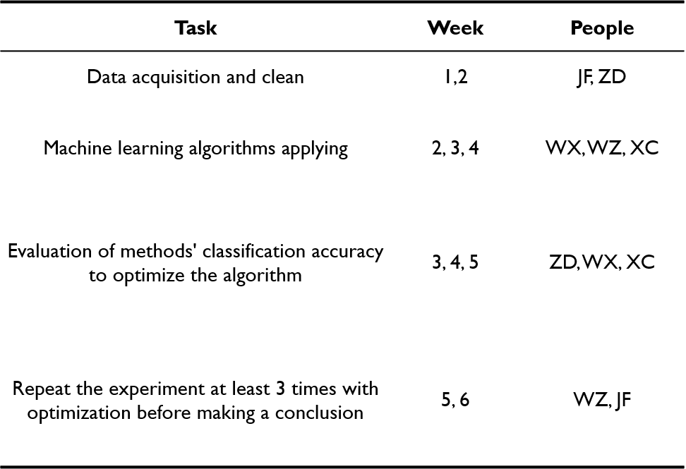

# HuffPost-News-Classification

## Introduction and Problem Definition
Today, with the rise of the Internet, more and more news is generated. Therefore, it is important to have a good news classification allowing people to access interest information effectively. To reach this goal, text classification, a process of assigning tags and categories to texts according to their descriptions or contents, should be applied [8]. As a foundation task in many Natural language processing (NLP) applications [6], test classification would transform unstructured text data into structured text effectively, which could be appropriate for analyzing or driving machine learning algorithms. Therefore, we want to predict categories for the given news to rapidly figure out essential tags of the news. We choose Kaggle News Category Dataset which contains around 200k news obtained from HuffPost with their categories, headlines, authors, short descriptions and links available for use [1]. The models trained on our dataset can be used to identify categories of tags for large quantities of untracked news articles or news with over-sensational headlines.

## Methods
### Data pre-processing
We will separate the data in JSON format into a training set (70%) and a testing set (30%). The main idea is to split the training dataset into random, equal-length example sets. Numeric labels will also be created based on the news category as the dependent variable. 
### Feature extraction and vectorization
Headlines and short descriptions of news need to be converted into numerical feature vectors. Bag-of-words model (measuring the number of times each word occurs in the documents) and TF-IDF model (measuring the strength of each word in the documents) will be considered [2]. Outputs should be the document-term matrix for insertion in different algorithms as listed below.

### Running five different machine learning algorithms
* NBC - Naive Bayes Classifier [3]
* SVM - Support-vector Machine [4]
* MLR - Multinomial Logistic Regression [5]
* CNN - Convolutional Neural Networks [6,7]
* RNN - Recurrent Neural Networks [6,7]

### Performance analysis and comparison
We will use a cross-validation method to evaluate the performance of different classifiers. Classifiers will make predictions on the respective sets, eventually by comparing the prediction outputs (as reflected by accuracy score, confusion matrix, precision and recall) we will determine which method performs the best.

## Potential Results
Models in our project could predict categories for news with headlines or short descriptions. Comparisons among different models would be visualized and presented.

One innovation is to compare the predictive power of different news features. Since the short descriptions and headlines are available, we will compare the model performance with them inserted as the input variable, respectively. Moreover, we will explore how the predictive power changes if the authors are known (i.e, adding one more explanatory variable).

## Discussion

The dataset from the real world contains some unnecessary information. Whether the data could be cleaned most accurately and efficiently is one of the potential difficulties we will face. If the difficulties could be overcome, this project might be a quick way for news agencies and readers to identify the news category given its headlines or short descriptions.

## References
[1] Kaggle News Category Dataset. https://www.kaggle.com/rmisra/ news-category-dataset. Accessed: February 2021.  
[2] Ramos, Juan. "Using tf-idf to determine word relevance in document queries." Proceedings of the first instructional conference on machine learning. Vol. 242. No. 1. 2003.  
[3] McCallum, Andrew, and Kamal Nigam. "A comparison of event models for naive bayes text classification." AAAI-98 workshop on learning for text categorization. Vol. 752. No. 1. 1998.  
[4] Tong, Simon, and Daphne Koller. "Support vector machine active learning with applications to text classification." Journal of machine learning research 2.Nov (2001): 45-66.  
[5] Kwak, Chanyeong, and Alan Clayton-Matthews. "Multinomial logistic regression." Nursing research 51.6 (2002): 404-410.  
[6] Yin, Wenpeng, et al. "Comparative study of CNN and RNN for natural language processing." arXiv preprint arXiv:1702.01923 (2017).  
[7] Lee, Ji Young, and Franck Dernoncourt. "Sequential short-text classification with recurrent and convolutional neural networks." arXiv preprint arXiv:1603.03827 (2016).  
[8] Monkeylearn.com. 2020. MonkeyLearn - Text-classification. [online] Available at: <https://monkeylearn.com/text-classification/> [Accessed 27 February 2021].
